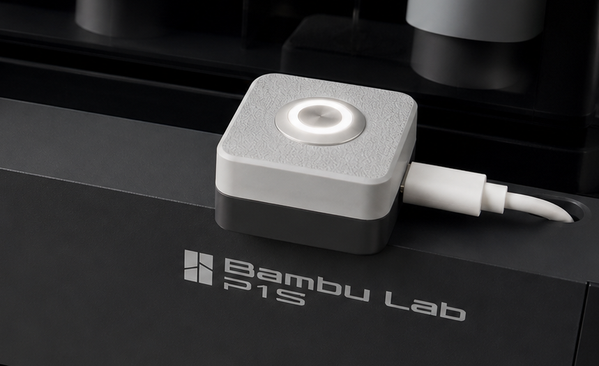

# Bambutton



A physical plate-clear button for Bambuddy.

Bambutton turns a small ESP32-C3 board into a dedicated wireless control for your printer. The LED ring shows when a plate needs clearing, and one button press marks the plate as clear in Bambuddy so the next queued job can be despatched automatically.

It gives each printer a simple shop-floor control that is quick to see, quick to press, and easier than opening the Bambuddy interface every time.

## Setup Routes

There are two supported ways to configure a board.

### Recommended: Setup Assistant GUI

Most users should use the setup assistant GUI. Release builds will be published so users will not need to install Python, `mpremote`, or `esptool` themselves.

The GUI guides the user through:

- Selecting the MicroPython firmware `.bin`.
- Selecting a connected ESP32-C3 board.
- Entering Bambuddy API connection details.
- Fetching printers from Bambuddy and choosing by friendly name.
- Setting the LED pin, button pin, Wi-Fi SSID, and Wi-Fi password.
- Flashing firmware and required code.
- Pushing settings-only updates.

### Advanced: Manual Flashing

Advanced users can use the Python scripts and command-line tools directly. This is useful for development, debugging, or working outside the packaged release assistant.

Manual setup requires:

- Python installed locally.
- Dependencies from `requirements.txt`.
- A data-capable USB cable.
- Knowing the serial port if `mpremote` cannot auto-detect the board.

## Layout

```text
.
├── firmware/   MicroPython firmware binaries for the board
├── micro/      MicroPython source files copied to the ESP32-C3
├── scripts/    Local helper scripts
└── src/        PC-side setup GUI
```

Whilst this repo does carry a firmware binary for the ESP32-C3 Generic board I strongly recommend using the latest version from the [micropython website](https://micropython.org/download/ESP32_GENERIC_C3/?utm_source=chatgpt.com)

Key files:

- `micro/main.py` - board entry point and application loop.
- `micro/config.json` - runtime configuration loaded by the board at boot.
- `micro/config_loader.py` - config loader with defaults.
- `micro/api.py` - low-level API-key HTTP client.
- `micro/bambuddy_api.py` - route-level Bambuddy API wrapper.
- `micro/wifi.py` - Wi-Fi connection helper.
- `micro/gpio_button.py` - debounced GPIO interrupt button helper.
- `micro/led_flasher.py` - timer-driven LED flasher.
- `firmware/ESP32_GENERIC_C3-20260406-v1.28.0.bin` - bundled ESP32-C3 MicroPython firmware image.
- `scripts/push_micro.py` - copies required MicroPython files to the board with `mpremote`.
- `scripts/run_main.py` - runs `micro/main.py` on the board without copying it as an auto-start file.
- `scripts/build_gui.py` - builds the distributable setup assistant executable with PyInstaller.
- `src/bambutton/gui.py` - GUI for selecting firmware, board, pins, Wi-Fi, API key, and printer.
- `src/bambutton_config_gui.py` - compatibility launcher for running the GUI from source.

## Setup Assistant GUI

For end users, use the built installer when available.

For development, run the GUI from source:

```bash
python -m pip install -r requirements.txt
python src/bambutton_config_gui.py
```

After installing the package, the GUI can also be launched with:

```bash
bambutton
```

## Release Packaging

Package versions are derived from Git tags via `hatch-vcs`. Tags that start with `v` runs the GitHub release workflow:

```bash
git tag v0.1.0
git push origin v0.1.0
```

The workflow builds and attaches:

- `Bambutton-windows.zip` - Windows executable.
- `Bambutton-macos.zip` - macOS app bundle.
- Python wheel and source distribution artifacts.

Local build commands are still available for development.

Build Python distribution artifacts:

```bash
python -m pip install ".[dev]"
python -m build
```

Build the setup assistant executable:

```bash
python scripts/build_gui.py
```

The macOS app is written to `dist/Bambutton.app`. The Windows executable is written to `dist/Bambutton.exe`. Release builds should attach the zipped app/executable so normal users can use the GUI route without installing Python.

## Manual Configuration

Manual users can edit `micro/config.json` before copying the files to the board:

```json
{
  "wifi": {
    "ssid": "your-wifi-ssid",
    "password": "your-wifi-password",
    "timeout_seconds": 10
  },
  "api": {
    "base_url": "http://your-server-ip:8000/api/v1",
    "key": "your-api-key"
  },
  "printer": {
    "id": 3,
    "poll_interval_seconds": 5
  },
  "led": {
    "pin": 3,
    "flash_interval_ms": 250
  },
  "button": {
    "pin": 4,
    "debounce_ms": 150,
    "pull": "down",
    "trigger": "rising"
  }
}
```

## Manual Copying

With `mpremote` installed and the ESP32-C3 connected:

```bash
scripts/push_micro.py
```

To push only configuration changes:

```bash
mpremote cp micro/config.json :
mpremote reset
```

To wipe the board filesystem before copying the project files:

```bash
scripts/push_micro.py --clean
```

To copy support files without `main.py`, preventing the app from auto-starting:

```bash
scripts/push_micro.py --no-main
```

To wipe the board and leave it without an auto-starting `main.py`:

```bash
scripts/push_micro.py --clean --no-main
```

If `mpremote` needs an explicit serial port:

```bash
scripts/push_micro.py --device /dev/tty.usbmodemXXXX
```

## Manual Run Without Auto-Start

To launch `micro/main.py` manually from your computer:

```bash
scripts/run_main.py
```

This relies on `mpremote` auto-detecting the connected board. If needed, pass the device explicitly:

```bash
scripts/run_main.py --device /dev/tty.usbmodemXXXX
```

The support modules and `config.json` still need to exist on the board. A typical development flow is:

```bash
scripts/push_micro.py --clean --nomain
scripts/run_main.py
```

## Manual Firmware Flashing

The GUI also performs these steps. Advanced users can run them manually with `esptool.py`, replacing the serial port with the board's port:

```bash
esptool.py --chip esp32c3 --port /dev/tty.usbmodemXXXX erase_flash
esptool.py --chip esp32c3 --port /dev/tty.usbmodemXXXX write_flash -z 0x0 firmware/ESP32_GENERIC_C3-20260406-v1.28.0.bin
```

After flashing firmware, copy the MicroPython files:

```bash
scripts/push_micro.py --clean
```

## Hardware

### Purchased Parts

- [ESP32-C3 Super Mini](https://www.aliexpress.com/item/1005008805263277.html?spm=a2g0o.order_list.order_list_main.5.61041802T9J6qU)
- [LED Button](https://www.aliexpress.com/item/1005004920346156.html?) - select the **3-6V momentary** option.

### Printed Parts

The top and bottom housing files are available on [makerworld](https://makerworld.com/en/models/2747607-bambutton-on-machine-bambuddy-plate-tracking).


These parts are designed to fit the hardware listed above.

You can print the housing in any colour or material you like. I found it useful to apply a small piece of double-sided tape to the ESP32-C3 board to hold it in place during assembly.

The small alignment holes are designed to accept short pieces of 1.75 mm filament (6 mm should do it!), which can be used as simple dowel pins to align the top and bottom halves.

The housing can be secured with 4 × M3 × 12 cap head bolts. These may not be required if the filament dowels are a tight enough fit.

I have also included a printed tool for doing up the M16 nut on the button as otherwise it is a bit difficult!

### Wiring Notes

The default configuration matches this final wiring:

```text
GPIO3 -> LED -> GND
GPIO4 -> button -> 3V3
```

Use GPIO numbers, not physical pin positions.

#### Button wiring:
- Connect one side of the momentary switch to GPIO 4 or your configured pin.
- Connect the other side of the switch to 3V3.
- The firmware enables the ESP32-C3 internal pull-down, so the button reads low when idle and high when pressed.
- The interrupt is configured for the rising edge, so it triggers on button press.

#### LED wiring:
- The LED output defaults to GPIO 3.
- Wire GPIO 3 to the LED anode through a suitable current-limiting resistor, then wire the LED cathode to GND.
- If wiring the LED inside the external button, connect it only according to the button's voltage/current requirements.
- Do not feed 5V into an ESP32-C3 GPIO. ESP32-C3 GPIO is 3.3V logic.
- If the button LED needs more current than a GPIO can safely provide, drive it through a transistor/MOSFET instead of directly from the GPIO.

#### Power and USB:

- Use a data-capable USB cable for programming. Charge-only USB cables will power the board but will not appear to `mpremote`.
- Power the ESP32-C3 from USB during setup and flashing.
- Disconnect power before changing wiring.
- Once configured a "power only" cable will be ok as no data is transferred.
- You can power this from the P1S internal USB port.
